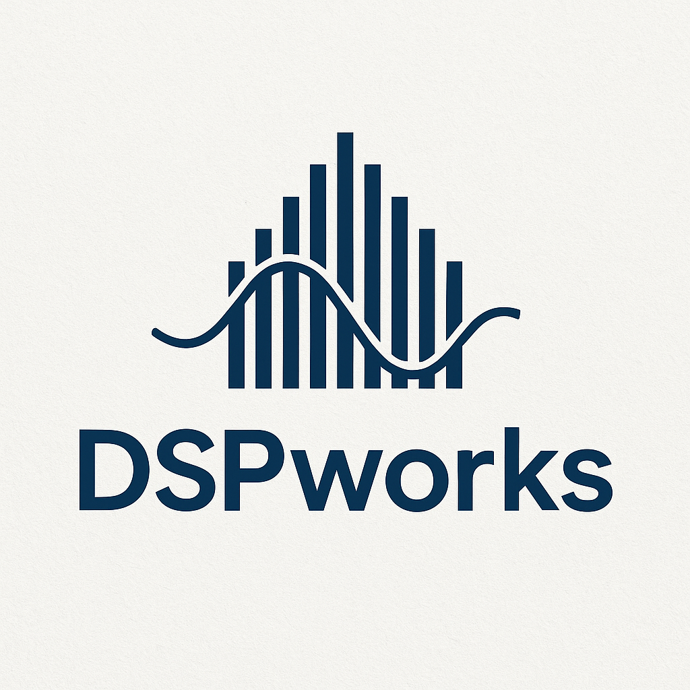
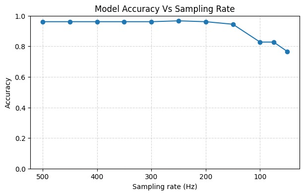

 <h1 style= "font-size:20 em;" align= center> <b>DSPworks</b> </h1>

Welcome to DSPworks!
This organization brings together SOTA open-source projects built on Digital Signal Processing principles, with a strong emphasis on audio and biosignal interpretation, as well as implementation with machine and deep learning models.

> ---
> *We strive to bridge the gap between academic theory and practical application — enabling innovation across multiple fields.*
> ---
---
## Projects 

### [Medical Signal Classifiers](https://github.com/DSPWorks4/Medical-Signal-Classifiers-) :

It proposes and implements a comprehensive set of Machine Learning (ML) and Deep Learning (DL)–based classification models designed to address a diverse range of diseases and biomedical conditions across multiple signal modalities.
These include EEG, ECG.
By integrating domain-specific feature extraction techniques with state-of-the-art neural architectures, the framework aims to improve diagnostic accuracy, reduce model training complexity, and bridge the gap between signal-level understanding and clinical insight.
Furthermore, it demonstrates robust performance and consistency across varying sampling frequencies, highlighting the models’ adaptability and reliability.

### [Anti-Aliasing Neural Audio](https://github.com/DSPWorks4/Anti-Aliasing.git)

The project combines traditional DSP filtering with neural network–based reconstruction to ensure smooth, high-fidelity sound across varying sampling frequencies.
It demonstrates how hybrid models can deliver cleaner, alias-free audio without sacrificing important signal detail.

### [Signal-Equalizer](https://github.com/DSPWorks4/Equalizer.git)

A full-stack audio processing system that combines AI-powered audio separation, custom equalization, and real-time audio analysis. It supports music and voice separation, dynamic FFT/STFT processing for editing, remixing, and analysis.

